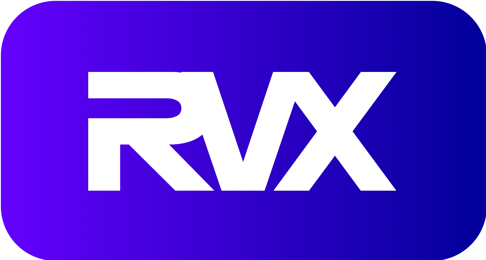

RVX is a RISC-V soft-core microcontroller IP for FPGAs written in Verilog. It is designed for easy integration into custom RTL designs, enabling rapid prototyping and deployment of RISC-V applications on FPGA platforms.

RVX implements the RV32I base integer instruction set of RISC-V, the Zicsr extension, and provides full support for machine mode (M-mode) operation. It can run bare-metal applications as well as real-time operating systems such as FreeRTOS. Its architecture includes on-chip memory, timers, and standard interfaces - including UART, GPIO, and SPI - providing easy connectivity to sensors, actuators, and other peripherals commonly used in FPGA-based designs.

Check out [RVX Documentation][1].

## Getting Started

The simplest way to get started is to try one of the example projects on your FPGA:

- [Hello World Example][2]

  A simple application that sends a "Hello World!" message to your computer using RVX UART. 

- [FreeRTOS Example][3]

  A project that uses FreeRTOS task scheduler and RVX GPIO to blink two LEDs in a timed sequence.

Check the [User Guide][4] to learn how to create an application from scratch.

## License

RVX is distributed under the [MIT License][5].

## Need help?

Please open a [new issue][6].

[1]: https://rafaelcalcada.github.io/rvx
[2]: https://rafaelcalcada.github.io/rvx/examples/helloworld
[3]: https://rafaelcalcada.github.io/rvx/examples/freertos
[4]: https://rafaelcalcada.github.io/rvx/userguide/
[5]: LICENSE.md
[6]: https://github.com/rafaelcalcada/rvx/issues